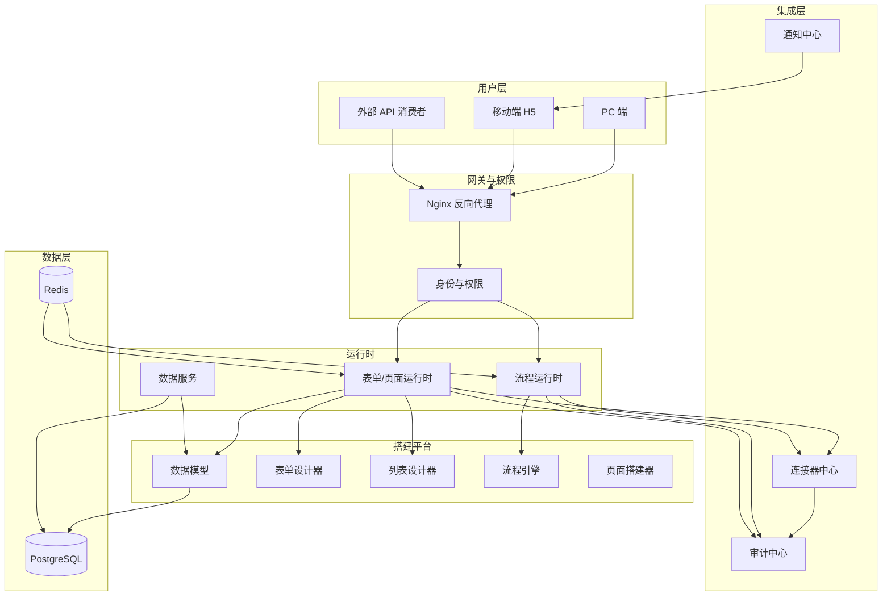

# tiedaoyun

一个**通用、易用、可自部署**的开源低代码/零代码平台。让非开发者也能快速搭出能跑的业务应用，同时不牺牲开发者的扩展能力。

[](LICENSE)
[](<>)

> 项目处于早期开发阶段（v0.1 MVP 筹备中），欢迎 Star 关注与共建。

## 为什么做 tiedaoyun

- **商业 SaaS 有限制**：简道云、明道云等能力成熟但锁定云端，无法自部署
- **现有开源方案不完美**：NocoBase、Appsmith、ToolJet、Budibase 方向各异，要么太轻、要么太重、要么对中文场景不友好
- **自部署需求**：个人/小团队希望平台能跑在自己的机器上，零运维成本
- **通用性优先**：避免"为单一行业定制"导致底座被锁死

差异化方向：

- **不锁定单一定位**：既要够轻（个人可用），也要够强（企业能用）
- **国内体验优先**：中文文档、本土 IM 适配（企微优先）
- **开发者友好**：保留 JS 增强位、自定义组件接入

## 核心功能

| 模块            | 说明                                                                              |
| --------------- | --------------------------------------------------------------------------------- |
| 数据模型设计器  | 可视化定义实体、字段、关系、索引、校验规则；支持 15+ 字段类型，主子表与多对多关系 |
| 表单设计器      | 拖拽生成表单，20+ 基础组件 + 5 类业务组件；字段权限、显隐规则、校验规则、公式计算 |
| 列表与详情视图  | 自动生成列表与详情页；筛选、排序、分组、聚合，表格/看板/甘特/日历/树形多视图      |
| 流程/审批引擎   | 可视化流程编排；审批、抄送、分支、并行网关、子流程；回退、转交、加签、会签、或签  |
| 页面/应用搭建器 | 拖拽组件搭建自定义页面与轻应用；事件动作、URL 参数、受控 JS 增强位                |
| 权限与角色      | 字段级、行级、按钮级三层权限；内置角色 + 自定义角色                               |
| 集成与连接器    | HTTP API、Webhook、MySQL/PostgreSQL、邮件、短信、企业 IM（企微优先）、文件存储    |
| 应用发布与版本  | 开发版/测试版/正式版三态版本；灰度发布、一键回滚                                  |
| 审计与日志      | 登录、数据变更、权限变更、流程操作、连接器调用全量记录；可检索、可导出            |
| 移动端          | H5 自适应；审批、点检、扫码、定位拍照等专用页面；离线暂存与恢复同步               |

## 快速开始

### 环境要求

- Docker 20.10+
- Docker Compose v2+

### 一键启动

```bash
git clone https://github.com/<your-org>/tiedaoyun.git
cd tiedaoyun
docker compose up -d
```

启动后访问 `http://localhost`，首次进入将引导你设置管理员账号。

单机部署包含：PostgreSQL（数据库）、Redis（缓存）、应用服务、Nginx（反向代理）。

> 单机模式建议承载：≤ 100 个应用、≤ 50 并发用户、≤ 10 万条数据。超出建议切换集群模式（规划中）。

### 升级

```bash
docker compose pull && docker compose up -d
```

升级失败自动回滚。数据默认每日自动备份，支持恢复到任意备份点。

## 本地开发

本仓库为 pnpm monorepo，目录结构遵循 [架构总览 §3](docs/architecture/overview.md#3-仓库与目录结构)：

```
tiedaoyun/
├── apps/        # web / mobile / server
├── packages/    # 共享包（schema-types / ui-kit / utils / form-render 等）
├── deploy/      # docker-compose / Dockerfile / nginx / backup
├── scripts/     # 一次性脚本（迁移、种子数据）
├── docs/        # PRD / HLD / ROADMAP / staging
└── package.json # pnpm workspace 根
```

### 环境要求

- Node.js 20 LTS+（推荐 22）
- pnpm 10+
- Docker 20.10+ / Docker Compose v2+（运行依赖服务时）

### 常用命令

```bash
pnpm install         # 安装依赖（含 husky 钩子）
make dev             # 启动所有 app 开发模式（等价 pnpm dev）
make lint            # ESLint
make typecheck       # tsc --noEmit（递归所有 workspace 包）
make test            # 运行单测
make build           # 构建所有包与 app
make format          # Prettier 格式化
```

也可直接用 pnpm：

```bash
pnpm -F @tiedaoyun/server dev      # 仅启动后端
pnpm -F @tiedaoyun/web dev         # 仅启动前端
```

提交代码前 `pre-commit` 钩子会自动跑 `lint-staged`（eslint + prettier）。详见 [CONTRIBUTING（待补充）]。

## 架构概览



## 适合谁

| 用户类型          | 核心诉求            | 典型使用方式        |
| ----------------- | ------------------- | ------------------- |
| 独立开发者 / 极客 | 自部署做个人/小项目 | Docker 一键起       |
| 小团队 / 创业公司 | 替代部分定制开发    | 自部署 + 团队协作   |
| 中小企业 IT 部门  | 给业务团队自助搭建  | 自部署 + 多工作空间 |
| 学习者 / 学生     | 学习与个人项目      | 公共 demo 实例      |

## 路线图

| 版本     | 主题     | 范围                                                             |
| -------- | -------- | ---------------------------------------------------------------- |
| v0.1 MVP | 核心搭建 | 数据模型、表单、列表、流程、页面、权限、审计、单机部署、基础文档 |
| v0.2     | 体验增强 | 多视图（看板/日历/甘特）、模板市场雏形、连接器扩展、基础教程     |
| v0.3     | 生态     | 二次开发 API、插件机制、自定义组件接入                           |
| v1.0     | 稳定版   | 文档齐备、教程丰富、社区可生产使用、集群模式（可选）             |

明确不做（MVP 阶段）：商业 SaaS 化运营、移动端原生 App、跨工作空间应用市场、信创/等保合规、AI 辅助搭建、商业计费/配额管理。

## 参与贡献

项目处于早期阶段，非常欢迎 issue、讨论与 PR。

- 提交问题或想法：Issue
- 贡献代码前请先阅读贡献指南（CONTRIBUTING，待补充）
- 详细产品设计见 [PRD.md](PRD.md)

## 许可证

本项目基于 [Apache License 2.0](LICENSE) 开源。
