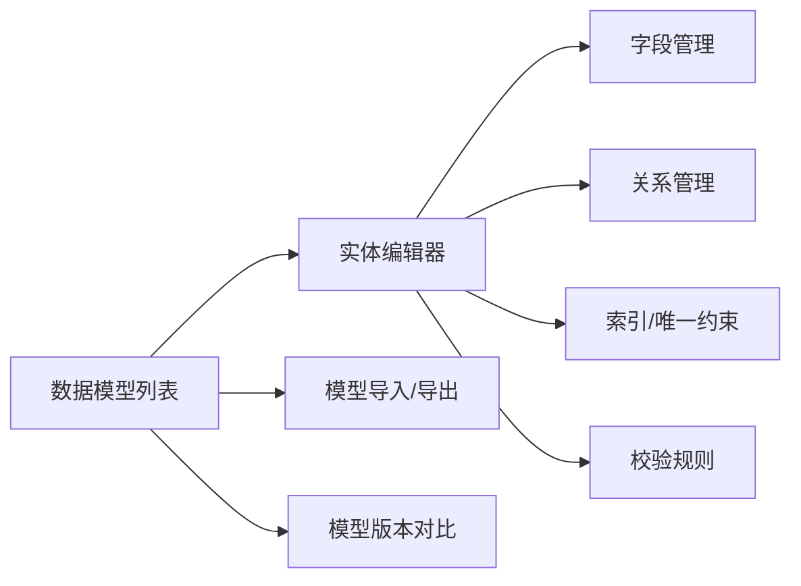
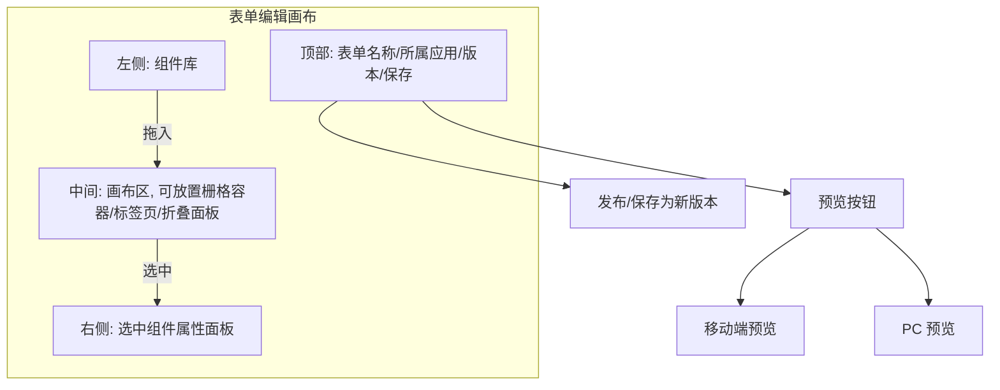
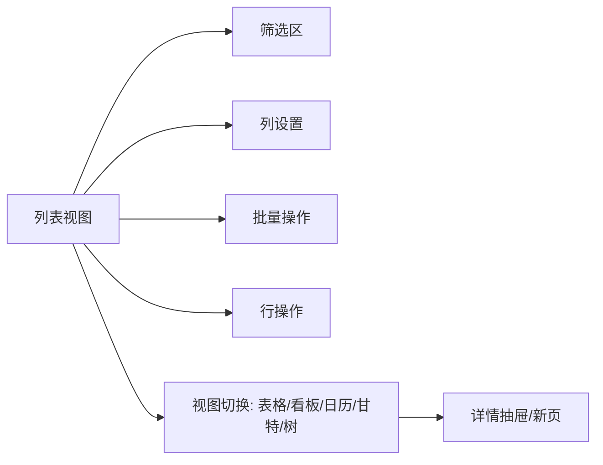
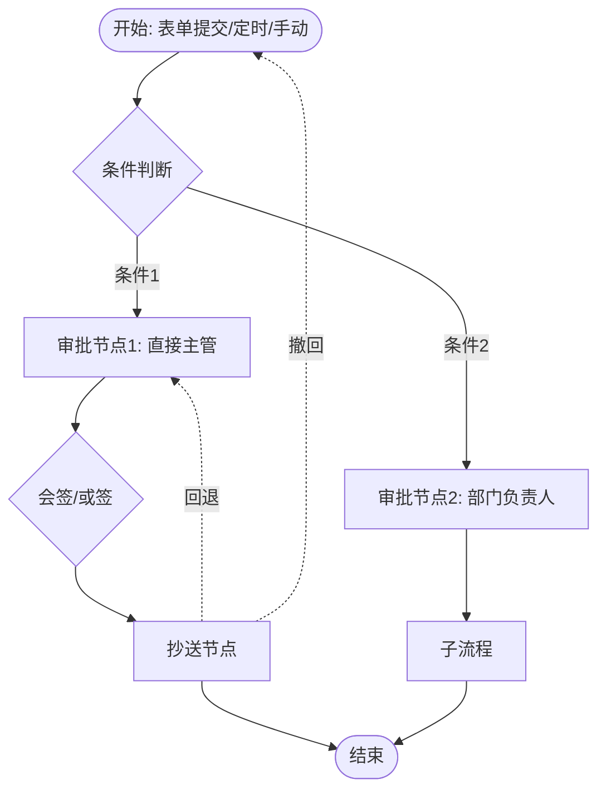
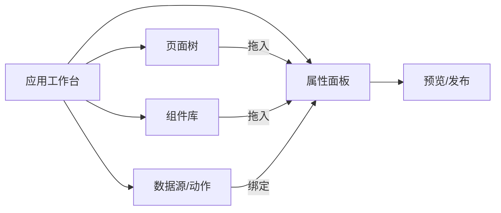
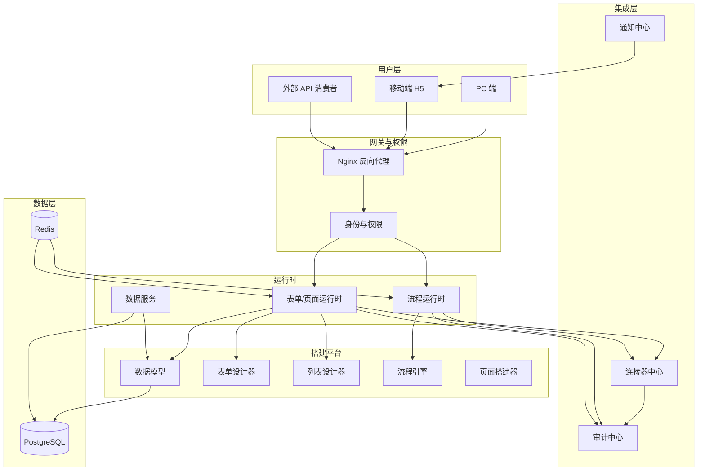

# 开源通用低代码平台 产品需求文档（PRD）

| 项目       | 内容                                                        |
| ---------- | ----------------------------------------------------------- |
| 项目名     | 待定 `[To be confirmed]`                                    |
| 文档版本   | v0.1 草案                                                   |
| 创建日期   | 2026-07-30                                                  |
| 最近更新   | 2026-07-30                                                  |
| 项目性质   | 开源 / 公开作品（非商业化）                                 |
| 目标许可证 | Apache 2.0 或 MulanPSL-2.0（待最终选定）`[To be confirmed]` |
| 文档状态   | 草案，待开发者评审                                          |
| 文档负责人 | 待指定 `[To be confirmed]`                                  |

## 变更记录

| 版本 | 日期       | 变更                                                                                                                           |
| ---- | ---------- | ------------------------------------------------------------------------------------------------------------------------------ |
| v0.1 | 2026-07-30 | 初稿；定位为开源/公开作品，移除商业化框架（多租户 SaaS、计费、SLA 商业指标、私有化范围、商务模式、严格验证阈值、共建标杆租户） |

---

## 0. 文档说明与术语约定

本文档面向 v0.1 MVP，目的是用最简方式说清楚 MVP 该做什么、不做什么，便于开发者快速进入开发。

**术语**：

- **搭建者（Builder）**：在平台上拖拽配置应用的人
- **使用者（End User）**：使用应用提交、查询、审批的人
- **管理员（Admin）**：管理应用上下架、成员、审计的人
- **应用（App）**：由一个或多个表单/列表/流程/页面组成
- **数据模型（Data Model）**：应用背后的实体与字段
- **工作空间（Workspace）**：隔离的协作单位，对应一个部署实例下的独立组织

证据强度约定：未在实证中验证的判断标注 `[Hypothesis]` 或 `[Assumption — to be confirmed]`。

---

## 1. 项目愿景

做一个**通用、易用、可自部署**的开源低代码/零代码平台，让非开发者也能快速搭出能跑的业务应用，同时不牺牲开发者的扩展能力。

---

## 2. 为什么做

- **商业 SaaS 限制**：简道云、明道云等能力成熟但锁定云端，无法自部署
- **现有开源方案不完美**：NocoBase、Appsmith、ToolJet、Budibase 方向各异，要么太轻、要么太重、要么对中文场景不友好
- **自部署需求**：个人/小团队希望平台能跑在自己的机器上，零运维成本
- **通用性优先**：避免"为单一行业定制"导致底座被锁死

---

## 3. 目标用户

| 用户类型          | 核心诉求              | 典型使用方式        |
| ----------------- | --------------------- | ------------------- |
| 独立开发者 / 极客 | 自部署做个人 / 小项目 | Docker 一键起       |
| 小团队 / 创业公司 | 替代部分定制开发      | 自部署 + 团队协作   |
| 中小企业 IT 部门  | 给业务团队自助搭建    | 自部署 + 多工作空间 |
| 学习者 / 学生     | 学习与个人项目        | 公共 demo 实例      |

---

## 4. 非目标（明确不做）

为保持 MVP 聚焦与项目可持续，**本期不做**：

- 商业 SaaS 化运营
- 移动端原生 App（仅 H5 适配）
- 跨工作空间应用市场
- 信创 / 等保合规
- 多 IM 适配（先做企微，接口抽象预留）
- AI 辅助搭建
- 私有化运维工具链
- 商业计费 / 配额管理

---

## 5. 竞品参考与差异化

不是要打败谁，而是从开源生态里取长补短：

| 项目            | 强项               | 我们的借鉴 / 差异化             |
| --------------- | ------------------ | ------------------------------- |
| NocoBase        | 数据模型、插件化   | 学习其数据模型与插件机制        |
| Appsmith        | UI 设计、组件丰富  | 借鉴其组件库思路                |
| ToolJet         | 连接器丰富         | 学习其连接器可视化配置          |
| Budibase        | 轻量、自动化       | 学习其快速启动体验              |
| 简道云 / 明道云 | 中文体验、模板丰富 | 借鉴其模板思路，初期先放 1–2 个 |

**差异化方向**：

- **不锁定单一定位**：既要够轻（个人可用），也要够强（企业能用）
- **国内体验优先**：中文文档、本土 IM 适配（企微优先）
- **开发者友好**：保留 JS 增强位、自定义组件接入

---

## 6. MVP 范围

### 6.1 必须包含

- 数据模型设计器（实体、字段、关系）
- 表单设计器（拖拽、规则、权限）
- 列表 / 详情视图（多视图、筛选、导出）
- 流程引擎（审批、抄送、节点配置）
- 页面搭建器（基础组件、动作事件）
- 权限（角色、行级、字段级）
- 审计日志
- 移动端 H5 自适应
- 单机部署（Docker Compose）

### 6.2 可以延后

- 模板市场 / 组件市场
- BI 看板
- AI 辅助搭建
- 集群部署（Kubernetes）
- 私有化运维工具
- 跨工作空间应用分发

---

## 7. 功能需求

> 本章是 MVP 的核心。所有功能点先以**功能总览表**给出索引，再分模块提供**原型 + 业务/交互/规则/权限/异常**五维度描述。原型使用 Mermaid 表达关键页面与状态流转。

### 7.1 功能总览表

| #   | 模块              | 功能描述                                                                                                                                                                    |
| --- | ----------------- | --------------------------------------------------------------------------------------------------------------------------------------------------------------------------- |
| 1   | 数据模型设计器    | 提供实体、字段、关系、索引、校验规则的可视化定义，是表单、列表、流程、应用的数据来源。支持文本、数字、日期、枚举、附件、关联、公式等 15+ 字段类型，支持主子表与多对多关系。 |
| 2   | 表单设计器        | 基于数据模型拖拽生成表单，支持 20+ 基础组件与 5 类业务组件（关联选择、级联地址、签名、电子签章、子表）。支持字段权限、显隐规则、校验规则、默认值、公式计算。                |
| 3   | 列表与详情视图    | 自动基于数据模型生成列表与详情页，支持筛选、排序、分组、列显隐、聚合、看板 / 甘特 / 日历 / 树形等多视图，支持行内编辑与批量操作。                                           |
| 4   | 流程 / 审批引擎   | 可视化流程编排：开始节点、审批节点、抄送节点、分支条件、并行网关、子流程、定时器、连接器。支持回退、转交、加签、减签、撤回、会签、或签。                                    |
| 5   | 页面 / 应用搭建器 | 通过拖拽组件搭建自定义页面与轻应用：栅格布局、组件库、事件动作、URL 参数、JS 增强位（受控开放）。可组合多张表单 / 列表 / 流程形成完整应用。                                 |
| 6   | 权限与角色        | 字段级、行级、按钮级三层权限。支持内置角色（管理员 / 搭建者 / 查看者）与自定义角色。                                                                                        |
| 7   | 集成与连接器      | 内置 HTTP API、Webhook、数据库（MySQL / PostgreSQL）、邮件、短信、企业 IM（企微，接口抽象预留扩展位）、文件存储。                                                           |
| 8   | 应用发布与版本    | 应用支持多版本管理：开发版、测试版、正式版。发布可指定可见范围、灰度比例、回滚版本。                                                                                        |
| 9   | 审计与日志        | 全量记录登录、数据变更、权限变更、流程操作、连接器调用，支持检索、导出、保留策略。                                                                                          |
| 10  | 移动端            | H5 自适应，关键场景提供专用页面（审批、点检、扫码、定位拍照）；支持离线暂存与恢复同步。                                                                                     |
| 11  | 单机部署          | Docker Compose 一键启动，包含数据库、应用服务、反向代理。                                                                                                                   |
| 12  | 模板与组件市场    | 官方模板 + 私有模板库。`[Phase 2]`                                                                                                                                          |

### 7.2 模块详细设计

#### 7.2.1 数据模型设计器

**原型（Mermaid）**

**功能描述**

- **业务逻辑**：搭建者新建一个"实体"（如"报销单"），定义字段（金额、类型、说明、附件等），可关联已有实体（关联"员工"作为提交人）。保存后系统生成数据库表与基础 CRUD 接口，自动作为后续表单、列表的来源。
- **交互逻辑**：拖拽字段排序、点击字段弹出属性面板、保存后即时预览生成的列表页结构。
- **规则约束**：
  - 字段名仅允许字母 / 数字 / 下划线，最长 64 字符，工作空间内唯一。
  - 文本字段长度 1–2000，可选多行；数字字段支持精度（最多 4 位小数）；日期支持"日期 / 日期时间"两种。
  - 关联字段必须选择目标实体与显示字段；级联删除需显式开启。
  - 字段一旦被表单引用，类型与必填规则变更需要走"影响分析"流程。
- **权限逻辑**：仅"搭建者"及以上角色可创建 / 修改；字段级权限在表单层定义。
- **边界与异常**：
  - 字段删除提示"被 X 个表单 / 流程引用"，并提供替换或级联策略。
  - 保存时若与已存在实体冲突，给出冲突项清单并阻止保存。

#### 7.2.2 表单设计器

**原型**

**功能描述**

- **业务逻辑**：搭建者从组件库拖入组件到画布，配置属性、规则、权限，绑定到数据模型中的字段。保存后表单可独立预览与发布。
- **交互逻辑**：
  - 拖入组件 → 自动绑定同名字段或弹窗选择字段。
  - 配置显隐规则：例如"金额 > 10000 时显示大额说明字段"。
  - 配置校验规则：手机号正则、身份证校验、自定义 JS 校验函数。
- **规则约束**：
  - 必填项在提交前必须填写，未填写时定位到第一个未填字段并提示。
  - 字段权限：4 个维度（可见 / 可编辑 / 必填 / 隐藏），按角色 + 部门双维度配置。
  - 子表组件支持最少 0 行、最多 50 行（可配置），提交时校验至少 1 行。
- **权限逻辑**：表单自身的查看权限继承应用；字段权限覆盖于表单之上。
- **边界与异常**：
  - 草稿未保存离开页面 → 浏览器原生提示。
  - 表单加载失败（数据模型变更）→ 提示"模型已变更，请重新绑定"并锁定提交。
  - 离线断网时移动端暂存本地，恢复后自动重试提交。

#### 7.2.3 列表与详情视图

**原型**

**功能描述**

- **业务逻辑**：自动基于数据模型生成默认列表，搭建者按需配置列、筛选、排序、分组、视图类型。
- **交互逻辑**：
  - 列设置：拖拽调整列顺序、设置列宽、设置列汇总。
  - 视图切换：表格 → 看板（按状态字段）、日历（按日期字段）、树（按父子关系）。
  - 行内编辑：双击单元格直接修改，单字段提交。
- **规则约束**：
  - 列表分页默认 20 条 / 页，可选 50 / 100；超过 10000 条提示"请使用筛选缩小范围"。
  - 导出 Excel / CSV 限制 5 万行 / 次，超量分批。
  - 字段级权限在列表中同步生效（无权限字段不显示也不导出）。
- **权限逻辑**：行级权限支持"我看全部"、"我看本部门"、"我看自己"等多种预置规则。
- **边界与异常**：
  - 关联字段展示名称为空时显示"-"，不报错。
  - 看板视图对应分组字段被删除 → 自动回退到表格视图并提示。

#### 7.2.4 流程 / 审批引擎

**原型**

**功能描述**

- **业务逻辑**：流程由"触发器 + 节点 + 流转条件"组成。触发器支持表单提交、定时、Webhook、连接器事件。节点支持审批、抄送、子流程、连接器调用、并行网关。
- **交互逻辑**：
  - 审批人支持：指定人员、角色、发起人自选、上级链、部门负责人、表单字段、连接器解析。
  - 操作支持：通过、拒绝、回退（指定节点）、转交、加签、减签、撤回。
  - 审批面板：PC 端侧边栏 + 移动端卡片式；可一键同意 / 拒绝，可填意见，可查看历史。
- **规则约束**：
  - 流程设计器拖拽限制：开始 / 结束节点单实例，禁止删除；
  - 会签：所有审批人都需通过；或签：任一通过即可。
  - 流程超时（默认 48h）自动转交、超时提醒、逾期预警可配置。
  - 一条流程实例的所有操作必须可追溯到操作人、时间、原值与新值。
- **权限逻辑**：
  - 仅发起人、当前待办人、抄送人可看流程详情。
  - 管理员可全局检索，但只读。
- **边界与异常**：
  - 审批人离职 / 禁用 → 自动转交到上级或备用审批人。
  - 流程设计修改对运行中实例的影响策略可配置（沿用旧版 / 升级到新版 / 手动选择）。

#### 7.2.5 页面 / 应用搭建器

**原型**

**功能描述**

- **业务逻辑**：搭建者通过拖拽组件 + 绑定数据源 + 配置动作事件的方式搭建自定义页面。多个页面 + 表单 + 流程组合成一个完整应用。
- **交互逻辑**：
  - 组件库：基础组件（容器、栅格、卡片、表格、表单）+ 业务组件（数据列表、数据详情、统计卡片、流程面板）。
  - 动作：打开页面、提交表单、调用连接器、跳转 URL、显示消息、关闭弹窗。
  - JS 增强位：受控开放（仅"高级搭建者"可见），用于复杂交互与自定义样式。
- **规则约束**：
  - 一个应用至少 1 个页面，最多 200 个页面。
  - 单页面引用的数据源 ≤ 20 个，超过提示拆分页面。
  - 组件嵌套层级 ≤ 10 层，超过限制提示重新设计。
- **权限逻辑**：应用可设置访问范围（全员 / 指定部门 / 指定角色），页面可覆盖应用级设置。
- **边界与异常**：
  - 数据源加载失败 → 组件降级为占位 + 重试按钮。
  - 动作链执行中失败 → 提示失败节点并支持跳过 / 重试。

#### 7.2.6 权限与角色

**功能描述**

- 三层权限：**功能级**（菜单 / 应用）→ **数据级**（行 / 部门 / 角色）→ **字段级**（列 / 单元格）。
- 角色分两类：内置角色（管理员 / 搭建者 / 查看者）与自定义角色。
- 权限可继承自组织架构（部门、岗位），也可独立于组织。
- 支持权限"申请-审批"流程：使用者可发起临时权限申请，审批通过后限时生效。

**规则约束**

- 角色删除前需迁移当前用户；不允许删除仍有成员的最后一个管理员角色。
- 字段级权限以"白名单"配置（默认拒绝，授权才可见），降低误配风险。

#### 7.2.7 集成与连接器

**功能描述**

- 内置连接器：HTTP API、Webhook、MySQL / PostgreSQL、邮件、短信、**企业 IM（当前仅企微，接口抽象预留扩展位）**、文件存储。
- 每个连接器以可视化方式配置鉴权、入参、字段映射、错误处理。
- 支持连接器在流程、页面动作、字段联动、连接器触发流程等多种场景使用。

**规则约束**

- 连接器调用超时默认 10 秒，可调 1–60 秒；超时计入监控告警。
- 数据库连接器仅允许 SELECT（默认），写操作需显式开启并审核。
- 每次调用记录完整请求 / 响应（敏感字段脱敏），保留 90 天。

#### 7.2.8 应用发布与版本

**功能描述**

- 应用支持三态版本：开发版、测试版、正式版。
- 发布流程：开发 → 测试（通知测试组）→ 正式（通知管理员审核 + 灰度比例）。
- 支持回滚到任意历史版本，回滚不影响数据。

**规则约束**

- 正式版必须有 changelog 摘要，否则不允许发布。
- 灰度比例以 1% → 10% → 50% → 100% 阶梯推进，每级观察 24h 无异常再升档。

#### 7.2.9 审计与日志

**功能描述**

- 记录类别：登录、权限变更、数据增删改、流程操作、连接器调用、应用上下架、导出操作。
- 检索维度：时间、用户、操作类型、对象、IP、设备。
- 导出：CSV / JSON；导出记录本身可被审计。
- 防篡改：日志采用追加写 + 哈希链 + 异地备份。

**规则约束**

- 默认保留 180 天，可配置最长 7 年。
- 敏感字段（身份证、手机号、银行卡）在日志中脱敏展示。

#### 7.2.10 移动端

**功能描述**

- H5 自适应布局，关键场景提供专用页面（审批、点检、扫码、定位拍照）。
- 提供"企业 App 容器"或微信 / 钉钉 / 飞书小程序 SDK，让业务 App 嵌入工作台。
- 离线缓存：在弱网 / 无网时暂存提交与查询结果，恢复后自动同步。

**规则约束**

- 离线暂存最多保存 200 条 / 用户，超量提示清空或立即同步。
- 移动端登录支持短信 / SSO / 生物识别，至少两种组合。

#### 7.2.11 单机部署

**功能描述**

- 提供 Docker Compose 一键启动包，包含：数据库（PostgreSQL）、应用服务、Redis（缓存）、反向代理（Nginx）。
- 默认监听 80 / 443 端口，提供配置向导（首次访问设置管理员账号）。
- 数据备份 / 恢复脚本：每日自动备份，支持恢复到任意备份点。
- 升级机制：`docker compose pull && docker compose up -d` 即可升级，升级失败自动回滚。

**规则约束**

- 单机模式建议承载：≤ 100 个应用、≤ 50 并发用户、≤ 10 万条数据。超出建议切换到集群模式（不在 MVP 范围）。

---

## 8. 架构

### 8.1 部署模式

| 模式                 | 描述                                                           | 范围    |
| -------------------- | -------------------------------------------------------------- | ------- |
| **单机模式（默认）** | Docker Compose 一键启动；包含数据库、应用服务、可选 Nginx 反代 | MVP     |
| 集群模式             | Kubernetes 部署；多副本；面向中大规模使用                      | Phase 2 |

### 8.2 架构图

### 8.3 关键能力

- 可观测：全链路日志、关键指标、本地健康检查
- 数据可恢复：每日自动备份 + 手动备份，恢复操作有审计
- 安全：HTTPS、内部 mTLS（生产建议）、密钥 KMS 管理、敏感字段落库加密
- 升级：滚动升级，失败自动回滚

### 8.4 性能基线（MVP 目标）

| 指标         | 目标值                      |
| ------------ | --------------------------- |
| 页面首屏加载 | ≤ 1.5s（同地域 P95）        |
| 流程审批响应 | ≤ 500ms（API P95）          |
| 数据查询响应 | ≤ 1s（列表 P95）            |
| 单实例承载   | ≤ 100 个应用，10 万级数据量 |
| 离线暂存     | ≤ 200 条 / 用户             |

---

## 9. 风险

| #   | 风险                                      | 概率 | 影响 | 缓解策略                                                |
| --- | ----------------------------------------- | ---- | ---- | ------------------------------------------------------- |
| R1  | 业务人员搭建能力不足，应用质量低          | 中   | 高   | 模板 + 引导 + 文档 + 示例                               |
| R2  | 性能瓶颈，单机难以承载                    | 中   | 中   | 文档明确单机承载上限；集群模式作为后续路径              |
| R3  | 流程引擎并发与稳定性问题                  | 中   | 高   | 流程实例状态机设计走评审 + 压测 + 灰度                  |
| R4  | 集成连接器故障引发业务中断                | 中   | 中   | 连接器熔断 + 失败重试 + 调用方告警 + 降级方案           |
| R5  | 移动端体验不足，使用者流失                | 中   | 中   | 关键场景（审批 / 点检 / 拍照）专门打磨                  |
| R6  | 文档 / 教程不完善，社区采用率低           | 中   | 高   | MVP 阶段同步输出 README、Quick Start、最佳实践          |
| R7  | 许可证 / 贡献协议选择不当，影响项目可持续 | 低   | 中   | 优先用主流许可证（Apache 2.0 / MulanPSL-2.0），明确 CLA |

---

## 10. 迭代路线

| 版本     | 主题     | 范围                                                             |
| -------- | -------- | ---------------------------------------------------------------- |
| v0.1 MVP | 核心搭建 | 数据模型、表单、列表、流程、页面、权限、审计、单机部署、基础文档 |
| v0.2     | 体验增强 | 多视图（看板 / 日历 / 甘特）、模板市场雏形、连接器扩展、基础教程 |
| v0.3     | 生态     | 二次开发 API、插件机制、自定义组件接入                           |
| v1.0     | 稳定版   | 文档齐备、教程丰富、社区可生产使用、集群模式（可选）             |

---

## 11. 验收标准（PRD 级）

> 本节是 PRD 自身的"完成度"质量门，**用于内部评审与签发**，不替代各功能的详细验收用例。

1. 文档覆盖 10 个核心功能模块 + 1 个部署模块，每个模块均含**功能总览表行 + 原型 + 五维度描述**。
2. 明确目标用户与典型使用方式。
3. 明确 MVP 必须包含与可以延后两类范围。
4. 至少识别 3 个核心风险，每项有缓解策略。
5. 至少包含 1 张参考项目对比表、1 张架构视图、5+ 张流程 / 页面原型。
6. 部署模式、性能基线、单机承载上限有专章。
7. 角色权限覆盖搭建者、使用者、管理员三类。
8. 所有事实性数据都标注来源或 `[To be supplemented]`。

---

## 12. 待确认事项清单

> 在评审与立项阶段需要由开发者 / 早期用户共同确认或补充。

1. **项目名 / 仓库名**：`[To be confirmed]`
2. **许可证**：Apache 2.0 vs MulanPSL-2.0 vs MIT
3. **第一个 IM 适配**：企微 vs 飞书 vs 钉钉（推荐先做企微，接口抽象预留扩展位）
4. **第一个连接器优先级**：HTTP / 数据库 / 邮件 / 短信 哪个先做
5. **README 与文档语言**：中文优先 / 中英双语 / 英文优先
6. **第一个 demo 应用**：演示搭建能力的标准示例（如"请假申请"）
7. **CONTRIBUTING / 贡献指南**：是否需要 CLA
8. **CI / 测试基础设施**：单元测试、集成测试、E2E 测试覆盖目标

---

> 文档结束。版本 v0.1 草案，等待开发者评审。
